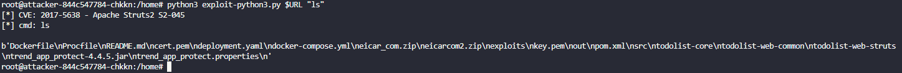

# How to Demo Container Security

This is a how to demo guide for Cloud One Container Security, where we'll be able to see in-action the power of Runtime Scanning and Runtime Security working together to provide visibility and control over your cluster, including some shortcuts to deploy your own EKS cluster and Calico.

## Good to Know

This demo is targeted to give a better understanding about how to deploy and how to take advantage of some cool features from Cloud One Container Security, where you'll be able to set up a AWS EKS cluster, set up Container Security into the cluster, deploy some applications and show how we can detect vulnerabilities within your containers during runtime and  help you to protect those containers by Runtime Security controls, giving you different response options and showing the effect each one may take into your applications.

## Background

Containers and its vast usage in cloud native applications needs no introduction. It's important to remember, however, that these applications are built benefiting from various open source libraries and Operating Systems, where risk may not be clear to a SecOps team for applications in production.

This new feature is our first step towards providing that visibility quickly and easily to SecOps practitioners. These detections have context, which includes CVE, severity, where the container is running, where the original image came from, and what's the fix available for it, in case one exists. This enables SecOps to quickly identify risky applications with important information such as the type of vulnerability and any available fixes, helping them to start the remediation process, integrating Ops and Dev.

We know that making this easy and painless is critical, and the demo will show exactly that. We also know that providing visibility into running containers is key, but not the only piece currently missing. That's why this feature is being built as part of a platform built to support us to soon bring this kind of detection closer to the developer, with GitHub, Docker and IDEs integrations to come.

## About the demo

I've created this demo to show some important points about container security. The Kubernetes network is flat by default. That means that if you have a vulnerable internet-facing application running within your Kubernetes cluster, if successfully exploited, and attacker can reach any pod, from any namespace running inside your cluster. Not to mention, if your DevOps team is creating pods if over privileged rights, or with write access to the worker node filesystem...
Here we'll understand a little bit about pod isolation works, pods network policies and the differences between terminate and isolate a pod by Container Security.

## Requirements

* Cloud One Account - Any region will do
* A Kubernetes cluster running version `1.22` or higher. Don't have one? Run `deploy-eks.sh` to deploy your own EKS cluster.
* helm
* Internet access 😅
* Project Calico running inside our cluster

If using the EKS deployment script:

* aws cli, configured to use your AWS account of choice.
* eksctl, at least version `0.105.0`, if you need to deploy a EKS cluster and want to leverage the EKS deployment script.

## No MacOS or Linux? No problem

If you are running a Windows machine (you nut!), don't worry. Let's go over how to prepare you entire environment straight from AWS dashboard.

1. Login to your AWS Account
2. Select the AWS CloudShell service, as below:

3. Upload the provided zip to your AWS CloudShell environment, as below:

4. Wait until you see a `File upload successful` popup, as below:

5. To install `eksctl`, run:

```bash
curl --silent --location "https://github.com/weaveworks/eksctl/releases/latest/download/eksctl_$(uname -s)_amd64.tar.gz" | tar xz -C /tmp
sudo mv /tmp/eksctl /usr/local/bin
eksctl version
```

6. To install `helm`, run:

```bash
sudo yum install -y openssl
curl https://raw.githubusercontent.com/helm/helm/main/scripts/get-helm-3 | bash
helm version
```

7. Once you cluster is up and running, deploy Project Calico into your cluster following this guide: <https://docs.aws.amazon.com/eks/latest/userguide/calico.html>.
8. Have Fun!

## How to Deploy It

Before you start the deployment of Container Security into EKS Cluster, first, let's create a specific policy for this demo:

1. Go to `runtime ruleset` page, click the `+ Add` button.
2. Give it a name and a description.
3. Optionally, if you want to show the granularity of Container Security, you can set label field to `key = app` and `value = java-goof` as we can see below:


4. Set the `(T1059.004)Update Package Repository` rule to `Terminate`.

5. Set the `(T1053.003)Schedule Cron Jobs` rule to `Isolate`.

6. Click `Save` and go to `Policies`.

7. Click `+ Add` and pick a name and description for the policy.

8. On `Runtime` tab, click `+ Add Ruleset` button and add our newly created ruleset configuration.

9. Save changes and proceed to the cluster deployment.

Here we have two options to help you deploy your Container Security application within your newly created cluster.

### Option 1

Run the `deploy-container-security.sh` script, passing your region and API Key as a parameter, as such: `./deploy-container-security.sh region apikey`. This should handle everything that is needed.
Back to Cloud One console and apply your previously created policy to your cluster.

### Option 2

Having problems with the script or you have no ❤️ towards MacOS or Linux? No problem.

1. Login to <https://cloudone.trendmicro.com/>
2. Go to Container Security
3. In the Clusters page, click the `+ Add` button.
4. Pick a name and description for your cluster. Select your previously created policy and make sure to check the **enabled** checkbox under **Runtime Security** and **Runtime Scanning**.
5. In the next window, copy the overrides file generated for you.
6. Make sure the indentation is correct!
7. Run the command provided by the dashboard to enroll the cluster, right below the overrides file content.

## How to Demo it

Phase 1: Runtime Scanning

We want to be able to showcase how easy and simple it is to deploy Container Security and get insightful and actionable information about vulnerabilities in running containers in matter of minutes, if not seconds.

1. Show the empty Vulnerability View page.
2. Once Container Security has been deployed, you can check all pods from all namespaces, run the command `kubectl get pods -A`
3. To check all namespaces run the command `kubectl get namespaces`.
4. Let's create a namespace for our demo app, run the command `kubectl create namespace java-goof`.
5. Now, we can deploy our application by running `kubectl apply -f java-goof.yaml` command.
6. Back to your Container Security console and go to `Vulnerability View page`, now you might have some detections on this page.
7. Filter by CVE and search for CVE ID `CVE-2017-5638`, you will see some vulnerable packages related to this vulnerability as below:


8. To check if our app is up and running, run `kubectl get svc -n java-goof` and copy the `EXTERNAL IP` address and paste in your browser.


9. It may take up to 5 minutos to see the Todolist MVC web page.


Phase 2: Setting Up the Environment to Trigger Runtime Security

Now it's time to test the impact this vulnerability brings to our environment and how dangerous it is to our cluster. This is a critical vulnerability which allows attacker to gain access to the host and take control of your host/container executing arbitrary commands inside our java-goof pod.
We'll show on this phase how we can exploit it using another container running inside the same host or via CloudShell. We'll use this vulnerability to list files from the java-goof container, create a file, and trigger those rules we've set during ruleset creation to show how the termination and isolation remediate actions works on the cluster.


1. Let's create a new namespace for the attacker container by running `kubectl create namespace attacker`.
2. You can see the new namespace by running `kubectl get namespaces`.
3. Create the attacker container with the command `kubectl run attacker --rm -i --tty --image igorschul/attacker -n attacker`.
4. You can open a new terminal window to check your pod by running `kubectl get pods -n attacker` as below:


5. When executed, you'll jump straight to the attacker container, run `cd /home/` to finde our exploit file which will be used to exploit our java-goof app.
6. To simplify our test, let's save our todolist web address into our container's memory by running `export URL="<EXTERNAL-IP>"`.
7. Remember to replace the value of `<EXTERNAL-IP>` by the value you've got from the step 8 on Phase 1.
8. Now, let's execute some attacks.

Phase 3: Triggering Runtime Security Events with Terminate Action

1. Run `python3 exploit-python3.py $URL "ls"` to list the files from our java-goof container as below:



2. Run `python3 exploit-python3.py $URL "echo >> teste.txt"` to use the exploit to create a file inside the java-goof directory.
3. Run `python3 exploit-python3.py $URL "ls"` again to see the newly `test.txt` created as below.


4. Now, let's see how Runtime Security with Terminate mitigation action can help as a security control for your clusters.
5. Run `python3 exploit-python3.py $URL "touch /etc/apt/testfile"` command and wait for the logs appear on Container Security Runtime Events.
6. Container Security will terminate the container and Kubernetes Scheduler, will spin up a new one from the scratch.
7. Once it's done, run the `python3 exploit-python3.py $URL "ls"` again and you'll see the `test.txt` it's not there.
8. And from second terminal tab, outside the attacker container, you can run `kubectl get pods -n attacker` again and you'll see the attacker pod name has changed.

Phase 4: Triggering Runtime Security Events with Isolate Action

1. To be able to trigger pod isolation, first you need to deploy a Kubernetes Network Plugin, such as Project Calico as mentioned here: <https://github.com/trendmicro/cloudone-container-security-helm>.
2. If you haven't done that yet, please back to `Requirements` step 7.
3. If you have deployed Calico correctly, from your cluster terminal (not the attacker) you can run `kubectl get networkpolicy -A` to see all the network policies as below:


4. From your attacker container terminal, run `python3 exploit-python3.py $URL "touch /etc/cron.daily/testfile"` to trigger the isolation action.
5. The mitigation action takes up to 5 minutes to isolate the pod.
6. Once you see the logs on your Container Security Runtime Events, back to the cluster terminal and run `kubectl get networkpolicy -A` again.
7. You'll see there's a new NetworkPolicy created and your web app isn't reachable anymore.


8. Container Security automatically create the network isolation policy, and applies it to your container by adding a label to your pod as the target for the policy.  
9. You can run `kubectl describe pod java-goof -n java-goof` to check the new label and `kubectl describe networkpolicy trendmicro-oversight-isolate-policy -n java-goof` to check the policy.


10. Once you delete the isolation network policy, your application will be reachable again.

# Attacking with CloudShell
If you want to show an attack from outside of your Kubernetes cluster, you can upload the `exploit-python3.py` file into CloudShell an execute the same commands we did on phase 3 and 4.

## Limitations

As you read at least a few hundred times, this is in preview, so limitations are expected. A few of them are:

* Some vulnerabilities might not show a Description, showing a placeholder text instead.
* Some vulnerabilities, despite having known fix available, might show up as not having a fix available
* If a new deployment is made without fixing a digest, and Container Security is already deployed to that cluster, to achieve speedier scans, you might not see a digest information on vulnerability detections for this container, seeing a placeholder "N/A" instead. This won't happen if container is already running when Container Security is deployed or a digest is fixed when deploying a container.  
* Perform helm uninstall and helm install when updating the helm chart for a new cluster. Do not helm upgrade, it will not work.
* Wait until the admission-controller is 1/1 running (from kubectl get pods -A) (it may take 30-40s after helm install) before deploying a pod into the cluster. Otherwise, the pod will not be scanned.
* Try not to deploy deployments/replica-sets because the deployment/replica-set itself will also be scanned. Deploy only pods instead.
* Aim to deploy pods with less than 1000 total vulnerabilities, hard cap 1500 vulnerabilities. Otherwise, deleting the pod will take longer and also risk timing out.
* New vulnerabilities will not appear for at least 30 seconds (probably closer to around a minute) after a pod has been deployed. So don't try to refresh too quickly.
* Images must be hosted in public registries, like Docker Hub.

## How to Clean the environment

You are not made of money. Delete all deployments/pods created during the demo. If you built the EKS cluster using the deployment script, run the `stop-cluster.sh` script so the cluster can be deleted whenever you are done for session/day. I heard no one is going to expense your environment if you forget to delete the cluster 👀

### Interesting Sources

<https://www.linuxfoundation.org/blog/a-summary-of-census-ii-open-source-software-application-libraries-the-world-depends-on/>
<https://www.dynatrace.com/info/cloud-application-security-ciso-research-1/>
<https://docs.aws.amazon.com/eks/latest/userguide/calico.html>
<https://cloudone.trendmicro.com/docs/container-security/faq/>
<https://www.youtube.com/watch?v=0zCHtrEJ9Bc>